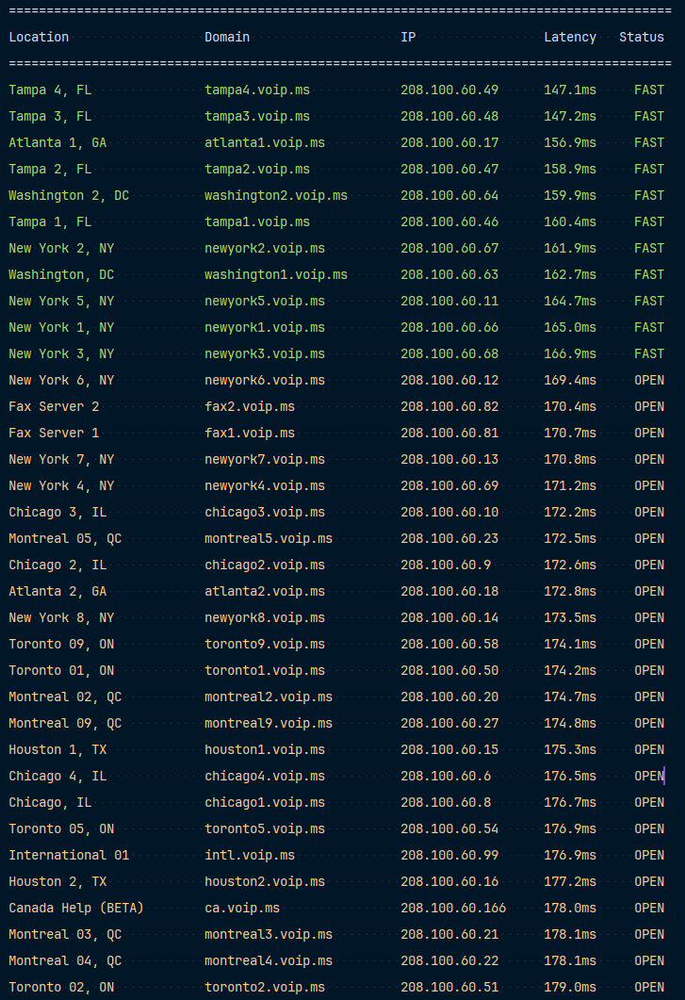

# 🌐 VoIP.ms Connection Test Tool

## 📡 Overview

A Python utility to test connection and availability of VoIP.ms server points of presence (POP) across multiple locations.

## ✨ Features

- 🚀 Super fast multi-threaded connection testing, done in seconds
- 🌈 Colored results
- 📊 TCP connection time measurement
- 🌍 Supports multiple server locations across the globe

## 🛠 How It Works

### Connection Testing Methodology

The utility performs TCP connection tests to the standard SIP port (5060) for each VoIP server, measuring:
- Connection establishment time
- Port availability
- Server responsiveness

### Result Visualization

Results are color-coded based on connection performance:
- 🟢 Green: Fast connections
- 🟡 Yellow: Moderate connections
- 🔴 Red: Slow or failed connections



## 🔧 Technical Details

### Code Structure

1. **Server Mapping**
    - Comprehensive dictionary with every VoIP.ms server locations
    - Contains domain, IP and geographical information

2. **Connection Testing**
    - Uses `socket` for TCP connection tests
    - Implements multi-attempt connection in case of failure
    - Measures connection latency

3. **Result Processing**
    - Calculates median latency
    - Applies color coding based on median latency
    - Sorts results by connection speed

## 🚀 Quick Start
### For Non-Programmers:
- Download the .exe file from the [Releases page](https://github.com/the-eduardo/VoIP.ms-Connection-Test/releases/latest) 

### Prerequisites For Programmers
- Python 3.11+
- `colorama` library

### Building
```bash
git clone https://github.com/the-eduardo/VoIP.ms-Connection-Test.git
cd VoIP.ms-Connection-Test
pip install colorama
```

### Usage
```bash
python main.py
```

## 📃 License
This project is released under the [GNU Affero General Public License v3.0 (AGPL-3.0)](https://github.com/the-eduardo/VoIP.ms-Connection-Test/blob/master/LICENSE).
### Key Highlights

- 🔓 Open-source and free to use
- 🌐 Requires source code disclosure for modifications
- 💻 Allows commercial use with full transparency

Full License Text: [GNU Affero General Public License v3.0](https://github.com/the-eduardo/VoIP.ms-Connection-Test/blob/master/LICENSE)

## 🤝 Contributions

Feel free to open issues or submit pull requests to improve the utility!

## ⚠️ Disclaimer

Connection tests may be blocked by firewall configurations. Results are indicative of network conditions at the time of testing.
